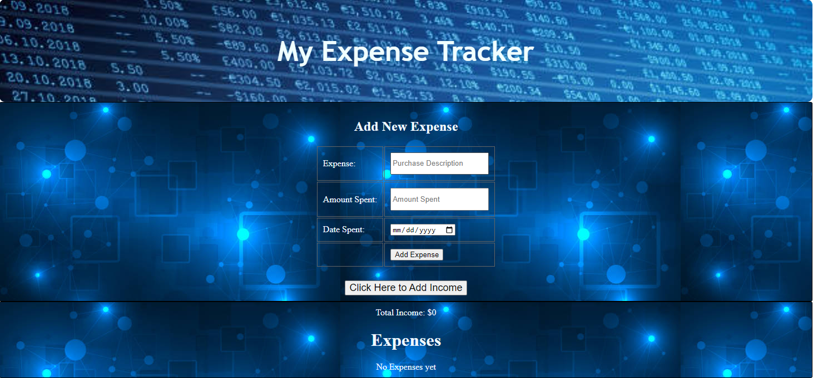
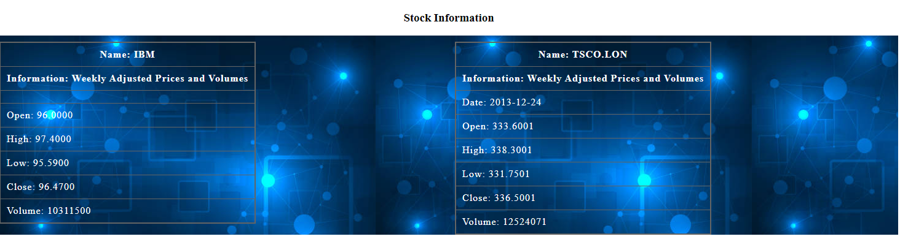

# MoneyTracker

- Keeping up with daily spending is not easy, but is a necessary part of life in order to ensure you have the funds for daily living expenses, saving enough for vacation, and will have enough for retirement. 

- This app will help you keep track of your daily spending, while comparing your tracked balance with that of your bank account.

https://bigevk.github.io/MoneyTracker/

